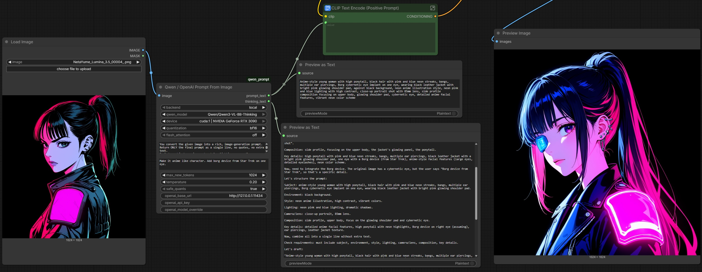

# ComfyUI Prompt Generator



## Description

This node generates a prompt based on an image. It allows you to add extra instructions for generation. It supports **Local Qwen2.5 / Local Qwen3 (Instruct/Thinking) / OpenAI compatible endpoints**, multi-GPU setups and CPU fallback.

The purpose of this node is to achieve the effect: "I want an image similar to this". 

## Installation
- Activate ComfyUI virtual environment. For example: `source venv/bin/activate`
- Copy `custom_nodes/qwen_prompt.py` to ComfyUI `custom_nodes/` folder
- Install additional depenencies from requirements.txt file: `pip3 install -r requirements.txt`
- Optional: Install flash attention package: `pip3 install flash-attn --no-build-isolation`. Install this package only when flash_attention parameter is set to *True*
- Start ComfyUI

Node will be available under: *d3cker -> Prompt-Generator -> Qwen / OpenAI Prompt From Image*

## Usage

Connect *IMAGE* from the "Load Image" node to the *image* input socket of the "Qwen / OpenAI Prompt From Image" node. 
Connect the *prompt_text* output socket to the "CLIP Text Encode" *value* box or to any text socket used for prompt input.

Optionally, "Preview as Text" nodes can be used to observe the thinking process and the final prompt. Add two "Preview as Text" nodes. Connect *prompt_text* to the *source* of the first one to view the generated prompt. Connect *thinking_text* to the *source* of the second one to view thinking details. Note: thinking is not supported by "Instruct" models. 

## Parameters

| parameter             | description                                                      | values                       |
|-----------------------|------------------------------------------------------------------|------------------------------|
| backend               | Choose a backend to run image recognition and prompt generation  | local / openai_compatible    |
| qwen_model            | Local Qwen model                                                 | *models list below*          |
| device                | Choose a device for local inference.                             | cpu / detected cuda devices  |
| quantization          | Choose a quantization method for larger models                   | INT8, INT4, FP16, BF16, FP32 |
| flash_attention       | Enable or disable flash attention for local models               | on / off                     |
| system_prompt         | System prompt                                                    | text                         |
| user_prompt           | User-defined prompt. Allows you to request additional details    | text                         |
| max_new_tokens        | Maximum amount of new tokens to be generated                     | INT (max 8192)               |
| temperature           | Temperature                                                      | FLOAT 0.0 - 1.0              |
| safe_quants           | Keeps safe quantization methods for different devices            | Bool                         |
| openai_base_url       | OpenAI endpoint                                                  | http://127.0.0.1:11434       |
| openai_api_key        | OpenAI token                                                     | text                         |
| openai_model_override | Model to use by OpenAI endpoint. For example: qwen3-vl:7b        | text                         |

Supported local (tested) models:
- Qwen/Qwen2.5-VL-3B-Instruct
- Qwen/Qwen2.5-VL-7B-Instruct
- Qwen/Qwen3-VL-2B-Instruct
- Qwen/Qwen3-VL-2B-Thinking
- Qwen/Qwen3-VL-8B-Thinking

The list may be updated by altering the `model_list` variable. Note: this node does not support local MoE variants, any other custom Qwen2.5 / Qwen3 VL (Instruct/Thinking) model should work. 

*safe_quants* enforces:
- Qwen3 runs only with INT8, INT4, FP16, BF16
- Qwen2.5 runs only with INT8, INT4, BF16
- cpu device runs only with FP32

*max_new_tokens* - if the output is truncated or the generated prompt contains thinking details only, increase this value

*user_prompt* - user-defined output details, for example: "make sure the background is black".
Please note that results may differ depending on the model and quantization method. 

*openai_base_url* - Any OpenAI-compatible endpoint. Tested with Ollama. Allows you to distribute the workload to remote hosts. 

*openai_model_override* - The model name to load via the OpenAI backend. For example `qwen3-vl:7b`

*device* - allows you to choose a GPU from the list. By default, ComfyUI nodes tend to bind to GPU0. If multiple GPU devices are present, this parameter allows you to use a different one. This makes it possible to keep models in memory and run recognition and generation models independently on different devices. "cpu" value allows you to offload recognition and prompt generation tasks to the CPU, but it is much slower than the GPU. This makes sense with small, non-thinking models (Qwen/Qwen2.5-VL-3B-Instruct)

## Ollama Local

On multi-GPU rigs, it's possible to run Ollama and bind it to a specific GPU or the CPU. You may want to take advantage of quantized models or custom models (for example: llava).

Scenario constrains: 
- The rig contains two GPUs 
- ComfuUI uses GPU0 for image generation
- Ollama uses GPU1 for image recognition and prompt generation

### Start Ollama server and bind it to GPU1

```
export CUDA_VISIBLE_DEVICES=1
./ollama serve
```

### Pull model
In a separate terminal, run:
```
./ollama pull qwen3-vl:7b
```

### Setup node

- backend: openai_compatible
- max_new_tokens: 2048
- openai_base_url: http://127.0.0.1:11434
- openai_model_override: qwen3-vl:7b

## Ollama Remote

In multi-host environments, it's possible to run Ollama on a remote machine. You may want to take advantage of quantized models or custom models (for example: llava).

Scenario constrains:  
- ComfuUI runs on a different machine than Ollama

### Start Ollama server and expose to the local network

```
export OLLAMA_HOST=0.0.0.0
./ollama serve
```

### Pull model
In a separate terminal, run:
```
./ollama pull llava:7b
```

### Setup node

- backend: openai_compatible
- max_new_tokens: 2048
- openai_base_url: http://IP_OF_OLLAMA_MACHINE:11434
- openai_model_override: llava:7b
